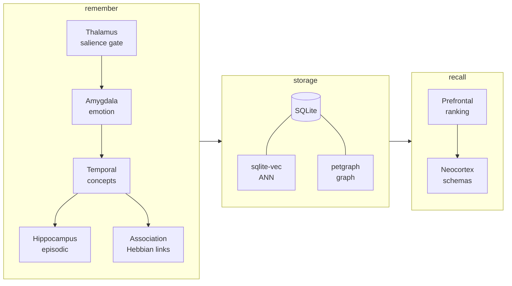
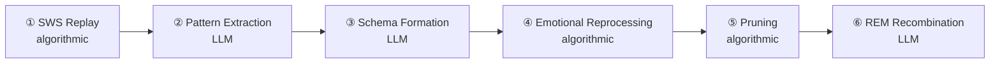

# CerebroCortex-RS — Architecture

> Reference doc for anyone implementing a build-order step or reviewing a PR.
> Python original: `../CerebroCortex` (read-only reference — do not modify).

---

## Overview

CerebroCortex is a brain-analogous AI memory system. It models six memory types (episodic, semantic, procedural, affective, prospective, schematic) across four durability layers (sensory, working, long-term, cortex) using:

- **ACT-R activation** — `B(t) = ln(Σ t_k^{-d})` — recency + frequency decay
- **FSRS retrievability** — `R(t, S) = (1 + t/9S)^{-1}` — spaced-repetition forgetting curve
- **Spreading activation** — Collins & Loftus, 2 hops, 0.6 decay/hop, 50-node cap
- **9 brain-region engines** — each handles a cognitive function
- **6-phase dream engine** — memory consolidation cycle (3 algorithmic + 3 LLM)

The Rust port is a clean translation of the Python semantics. The cognitive architecture, MCP tool surface (66 tools), and wire format are preserved exactly.

### Engine pipeline



### Dream consolidation



---

## Workspace layout

```
CerebroCortex-RS/
├── Cargo.toml                        # workspace
├── CLAUDE.md                         # agent + developer guide
├── ARCHITECTURE.md                   # this file
├── CONTRIBUTING.md                   # PR guide
├── crates/
│   ├── cerebro/                      # library — all cognitive logic
│   │   └── src/
│   │       ├── lib.rs
│   │       ├── types.rs              # enums + newtype IDs + VisibilityScope
│   │       ├── config.rs             # all tunable parameters + env resolution
│   │       ├── cortex.rs            # CerebroCortex coordinator (step 7)
│   │       ├── models/
│   │       │   ├── memory.rs        # MemoryNode, StrengthState
│   │       │   ├── link.rs          # AssociativeLink (with link-age decay)
│   │       │   ├── episode.rs       # Episode, EpisodeStep
│   │       │   └── agent.rs         # Agent
│   │       ├── activation/
│   │       │   ├── actr.rs          # B(t) = ln(Σ t_k^{-d}) + ε
│   │       │   ├── fsrs.rs          # R(t,S), update_stability, update_difficulty
│   │       │   ├── spreading.rs     # Collins & Loftus 2-hop spreading
│   │       │   └── mod.rs           # recall_score() weighted blend
│   │       ├── storage/
│   │       │   ├── sqlite.rs        # SQLite schema + CRUD (source of truth)
│   │       │   ├── graph.rs         # petgraph in-memory (rebuilt on init)
│   │       │   ├── vector.rs        # sqlite-vec ANN + FTS5 fallback
│   │       │   └── mod.rs           # StorageCoordinator
│   │       └── engines/
│   │           ├── thalamus.rs      # GatingEngine — salience gating
│   │           ├── amygdala.rs      # AffectEngine — emotional salience
│   │           ├── temporal.rs      # SemanticEngine — facts + concepts
│   │           ├── hippocampus.rs   # EpisodicEngine — sequences
│   │           ├── association.rs   # LinkEngine — Hebbian links
│   │           ├── cerebellum.rs    # ProceduralEngine — workflows
│   │           ├── prefrontal.rs    # ExecutiveEngine — intentions
│   │           ├── neocortex.rs     # SchemaEngine — abstractions
│   │           └── dream.rs         # DreamEngine — 6-phase consolidation
│   ├── cerebro-mcp/                  # MCP-over-stdio binary (63 tools)
│   │   └── src/
│   │       ├── main.rs
│   │       ├── transport.rs         # newline-delimited JSON-RPC over stdio
│   │       ├── dispatch.rs          # initialize handshake + tool routing
│   │       └── tools.rs             # tool schema registry (63 tools)
│   ├── cerebro-api/                  # axum REST API + dashboard (step 11)
│   └── cerebro-cli/                  # clap CLI (step 11)
├── tests/
│   ├── integration_test.rs           # build-order gate tests
│   └── fixtures/
│       └── activation.json           # generated by scripts/gen_activation_fixtures.py
├── crates/cerebro/benches/
│   └── activation_bench.rs           # criterion benchmarks (ACT-R, FSRS)
├── deploy/
│   └── cerebro.service               # systemd unit
└── scripts/
    └── gen_activation_fixtures.py    # generates ground-truth activation.json
```

---

## Dependency map (Python → Rust)

| Python | Rust | Notes |
|--------|------|-------|
| `python-igraph` | `petgraph` | DFS/BFS/shortest path built in |
| `chromadb` | `sqlite-vec` | ANN in SQLite — zero extra process |
| `sentence-transformers` | `fastembed` | ONNX Runtime, 384-dim, ~33MB, no GPU |
| FTS5 fallback | SQLite FTS5 (built-in) | Keyword search when sqlite-vec unavailable |
| `fastapi` + `uvicorn` | `axum` | Same family as agentd |
| MCP Python SDK | Hand-rolled JSON-RPC over stdio | Avoids SDK churn |
| `anthropic` (dream LLM) | `reqwest` + JSON | Direct HTTP — same pattern as agentd |
| `pydantic` | `serde` + `serde_json` | Derive macros replace field decorators |
| `click` | `clap` | Near-identical ergonomics |
| `watchdog` | `notify` | Cross-platform inotify wrapper |
| `pillow`/`pytesseract`/`pymupdf` | `image` + `lopdf` | Vision extras — Phase 3 only |
| `pytest` | `cargo test` | Built-in, parallel by default |

**Key insight:** `sqlite-vec` + FTS5 means the entire storage layer lives in **one SQLite file** with zero external services. This is cleaner than Python's triple-backend (SQLite + igraph in-memory + chromadb process).

---

## Core types

### Memory types and layers

```
MemoryType: Episodic | Semantic | Procedural | Affective | Prospective | Schematic
MemoryLayer: Sensory (minutes) | Working (days) | LongTerm (months) | Cortex (permanent)
Visibility: Private (agent-only) | Shared (all agents) | Thread (cross-agent dialogue)
```

### VisibilityScope

Every SQL query and graph traversal carries a `VisibilityScope`. It produces a SQL fragment that is AND-ed into every query — this is the multi-agent isolation boundary.

```rust
pub struct VisibilityScope { pub agent_id: Option<AgentId> }
// None  → "1=1"          (global view)
// Some  → "(visibility='shared' OR (visibility='private' AND agent_id=?))"
```

### AssociativeLink

Links carry an `effective_weight()` method that applies time-based decay (half-life 30 days). Spreading activation uses this, not the raw weight. This mirrors Python's `LINK_DECAY_HALFLIFE_DAYS`.

---

## Activation system

Three subsystems, all pure numerical computation. No external dependencies.

### ACT-R base-level activation
```
B(t) = ln( Σ t_k^{-d} ) + ε
```
- `t_k` = seconds since k-th access
- `d` = decay rate (default 0.5)
- `ε` ~ Uniform(-noise, +noise), default noise = 0.4
- Access timestamps capped at 50 per memory (`MAX_STORED_TIMESTAMPS`)

### FSRS retrievability
```
R(t, S) = (1 + t / 9S)^{-1}
```
- `t` = days since last review
- `S` = stability (days; range [0.1, 365])
- Updated on retrieval: success → S grows; failure → S × 0.5

### Combined recall score
```
score = 0.35 × vector_sim + 0.30 × actr_norm + 0.20 × fsrs + 0.15 × salience
```
Weights in `config.rs` mirror Python `SCORE_WEIGHT_*` constants exactly.

### Spreading activation
Collins & Loftus: BFS from seed nodes, max 2 hops, 0.6 decay per hop, 50-node cap, 0.05 threshold. Conductance per edge = `link_type.activation_weight() × link.effective_weight(now, halflife)`.

---

## Storage

**SQLite is the single source of truth.** The graph and vector index are derived caches:

- `GraphStore` — petgraph `Graph<MemoryId, AssociativeLink>` rebuilt from `links` table on init. Fast neighbor traversal and spreading activation.
- `VectorStore` — sqlite-vec extension for cosine ANN search on `memories.embedding` column. Falls back to FTS5 keyword search if the extension is not loaded.

Write order: **SQLite first, then update graph/vector in memory.** Never write to graph or vector independently.

### Schema highlights

- `memories` — 19 columns including `access_times` (JSON array of ISO timestamps for ACT-R), `fsrs_stability`, `fsrs_difficulty`, `embedding` (BLOB for sqlite-vec), `deleted_at` (soft delete)
- `links` — `(source_id, target_id, link_type)` PK; `last_traversed` + `traversal_count` for link-age decay
- `memories_fts` — FTS5 virtual table with INSERT/DELETE/UPDATE triggers keeping it in sync
- `audit_log` — append-only record of every agent action
- `dream_reports` — persisted dream cycle results

---

## Dream engine (6-phase consolidation)

| Phase | Type | Description |
|-------|------|-------------|
| 1 — SWS Replay | Algorithmic | Replay recent episodes; strengthen temporal links |
| 2 — Pattern Extraction | LLM | Cluster similar memories; LLM summarises patterns |
| 3 — Schema Formation | LLM | Abstract episodes → schematic memories |
| 4 — Emotional Reprocessing | Algorithmic | Adjust salience based on emotional markers |
| 5 — Pruning | Algorithmic | Remove stale, low-salience, orphan sensory-layer memories |
| 6 — REM Recombination | LLM | Find non-obvious connections across the graph |

LLM call budget: `DREAM_MAX_LLM_CALLS = 20` per cycle per agent. Phases 2, 3, 6 share this budget; the engine stops early if exhausted.

---

## MCP server

`cerebro-mcp` exposes 66 tools over newline-delimited JSON-RPC on stdin/stdout. Stderr is for tracing logs. The protocol version is `"2024-11-05"`.

**Tool categories:**
- Core: `remember`, `recall`, `get_memory`, `update_memory`, `delete_memory`
- Association: `associate`, `memory_neighbors`, `common_neighbors`, `find_path`, `check_near_duplicates`
- Session/thread: `session_save`, `session_recall`, `get_thread_memories`, `prune_thread`
- Episodic: `episode_start/add_step/end`, `get_episode`, `get_episode_memories`, `list_episodes`
- Dream: `dream_run`, `dream_status`
- Prospective: `store_intention`, `list_intentions`, `resolve_intention`
- Procedural: `store_procedure`, `list_procedures`, `find_relevant_procedures`, `record_procedure_outcome`
- Analytics: `emotional_summary`, `activation_curve`, `activation_heatmap`, `activation_at_risk`, `memory_health`, `cortex_stats`, `memory_graph_stats`, `audit_summary`, `query_audit`
- Tags: `list_tags`, `delete_tag`, `rename_tag`, `merge_tags`
- Schema: `create_schema`, `list_schemas`, `find_matching_schemas`, `get_schema_sources`
- Multi-agent: `register_agent`, `list_agents`, `share_memory`, `send_message`, `check_inbox`, `list_threads`
- System: `cognitive_bootstrap`, `ingest_file`, `describe_image`, `search_vision`, `export_memories`
- Lifecycle: `list_deleted`, `restore_memory`, `purge_memory`, `bulk_delete`, `purge_all_deleted`, `get_memory_versions`, `restore_version`

Tool descriptions are verbatim from Python `interfaces/mcp_server.py` — they are agent-facing strings and must not change.

> **Note:** the Python server had 63 tools at the time the port began; the count grew to 66 as the Python version was updated in parallel. All 66 are wired in `cerebro-mcp/src/dispatch.rs`.

---

## Build order and gates

All 12 steps are complete and production-deployed.

| Step | Gate | Status |
|------|------|--------|
| 1 | `cargo test types_roundtrip` — serde round-trips | ✓ |
| 2 | `cargo test activation_fixtures` — ACT-R + FSRS + spreading within 1e-4 of Python | ✓ |
| 3 | `cargo test storage_basic` — schema init, insert, scope-filtered get | ✓ |
| 4 | `cargo test storage_vector` — cosine search returns expected ordering | ✓ |
| 5 | `cargo test storage_graph` — neighbor traversal matches SQLite links | ✓ |
| 6 | `cargo test engines_*` — all 8 deterministic engines pass | ✓ |
| 7 | `cargo test cortex` — `remember()` persists, `recall()` returns matching memory | ✓ |
| 8 | MCP handshake against agentd — `remember` + `recall` tools | ✓ |
| 9 | All 66 tools respond without panic | ✓ |
| 10 | Dream cycle runs all 6 phases with live Anthropic key | ✓ |
| 11 | `cerebro stats` and REST `/health` respond correctly | ✓ |
| 12 | `cargo test db_compat` — Rust opens a Python-generated `cerebro.db`, migrates, reads memories | ✓ |

---

## Python → Rust quick reference

| Python | Rust |
|--------|------|
| `@dataclass` / Pydantic model | `#[derive(Debug, Clone, Serialize, Deserialize)] struct` |
| `Enum` | `enum` + `#[serde(rename_all = "snake_case")]` |
| `Optional[T]` | `Option<T>` |
| `list[T]` | `Vec<T>` |
| `dict[K, V]` | `HashMap<K, V>` |
| `async def` / `await` | `async fn` / `.await` |
| `datetime.utcnow()` | `Utc::now()` (chrono) |
| `uuid4()` | `Uuid::new_v4()` |
| `float` (weights, salience) | `f32` (half the memory of f64, sufficient precision) |
| `logging.getLogger` | `tracing::info!` / `tracing::error!` |
| `pytest` fixture | `#[tokio::test]` + shared `TestDb` helper |
