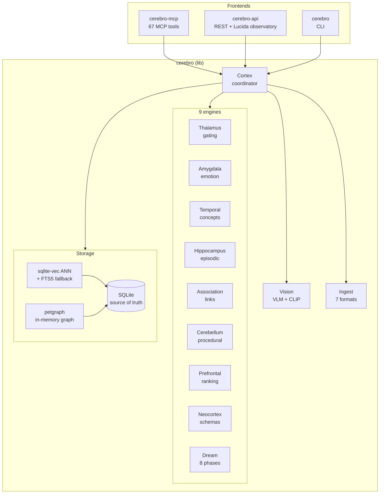
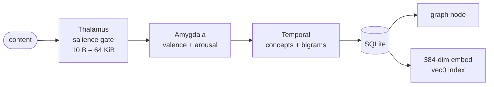
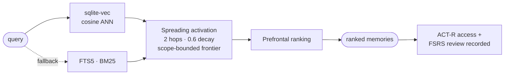
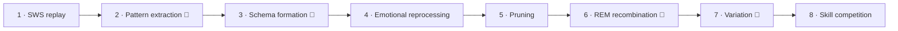
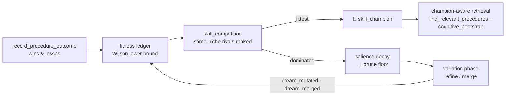
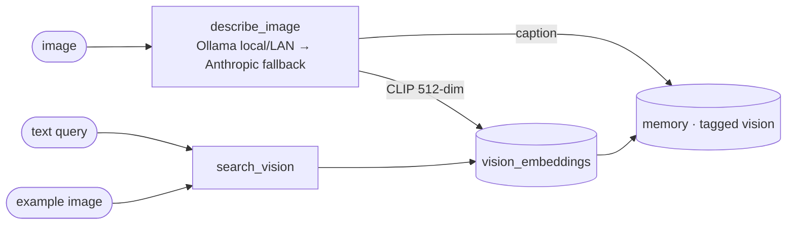

<div align="center">


# CerebroCortex-RS

**A brain-analogous memory system for AI agents — pure Rust, one binary, one SQLite file.**

*Memories that decay, dreams that consolidate, skills that compete to survive.*

[](https://rustup.rs)
[](#-the-tool-surface-67)
[](#-building-from-source)
[](#-deployment)
[](LICENSE)

</div>

---

Your agent calls `remember` and `recall` over MCP. Underneath, nine engines named after the brain regions they imitate run the content through a salience gate, tag it with emotion, link it into an association graph, and embed it for semantic search. Memories strengthen when retrieved and fade when ignored — real ACT-R and FSRS math, not a vector-store metaphor. At night, a dream cycle replays, abstracts, prunes, and recombines. Procedures that keep failing lose their standing to rivals that win.

All of it compiles to a single binary that idles at **23 MB**:

```
Bare binary (no model):   23 MB RSS,  6 threads,  26 ms recall  (FTS5 + spreading activation)
With BGE-small-en-v1.5:  275 MB RSS,  9 threads,  26 ms recall  (cosine ANN, 384-dim)
Binary size:              29 MB stripped arm64 ELF
Cold start:              ~4.4 s  (graph rebuild + model load from cache)
```

Hot-swapped into a live [ApexOS](https://github.com/buckster123/ApexOS) Pi 5 by changing one line in `plugins.toml`. agentd counted 67 tools and moved on.

## ✨ What's inside

<table>
<tr>
<td width="50%" valign="top">

### 🧠 A cognitive memory model
Six memory types across four consolidation layers. Recall blends **vector similarity + ACT-R activation + FSRS retrievability + salience** — recency, frequency, and importance all matter, and every retrieval sharpens what it touches.

</td>
<td width="50%" valign="top">

### 🌙 An 8-phase dream cycle
Nightly consolidation: episodic replay, LLM pattern extraction with semantic re-discovery detection, schema formation, emotional reprocessing, pruning, REM recombination — plus two evolutionary phases below.

</td>
</tr>
<tr>
<td valign="top">

### 🧬 Darwinian skill selection
Procedures carry a win/loss ledger. A dream phase ranks same-niche rivals by **Wilson lower bound**, crowns a `skill_champion` 👑, decays the dominated toward retirement, and LLM-mutates strugglers into fresh variants. Retrieval prefers the crowned.

</td>
<td valign="top">

### 👁 A vision loop
`describe_image` captions through a tiered backend (local/LAN Ollama → Anthropic) and CLIP-indexes the image; `search_vision` recalls images by text or by example image in one shared 512-dim space.

</td>
</tr>
<tr>
<td valign="top">

### 📥 File ingestion
`ingest_file` turns markdown, code, JSON, CSV, HTML, PDFs, and images into searchable memories — chunked, tagged with provenance, and fully reversible via `find_by_tags` + `bulk_delete`.

</td>
<td valign="top">

### 🤝 Multi-agent, scoped, audited
Private/shared/thread visibility enforced **inside the SQL**, a shared-only federation scope for mesh peers, message inboxes, and a self-history audit log that answers *"what did I actually do, in order?"*

</td>
</tr>
</table>

## 🚀 Quick start

```bash
git clone https://github.com/buckster123/CerebroCortex-RS
cd CerebroCortex-RS
cargo build --release -p cerebro-mcp     # ~2 min on a Pi 5
```

Wire it into any MCP client (Claude Code shown):

```json
{
  "mcpServers": {
    "cerebro-cortex": {
      "command": "/path/to/target/release/cerebro-mcp",
      "env": { "CEREBRO_DATA_DIR": "/path/to/brain" }
    }
  }
}
```

First `remember` downloads the ~128 MB embedding model to the cache; set `CEREBRO_EMBED_MODEL=""` to skip it and run keyword-only in 23 MB. Then:

```
remember("The deploy hot-swap needs systemctl stop before cp — text file busy otherwise")
recall("how do I deploy?")   → ranked, activation-weighted, and now slightly stronger
```

> [!TIP]
> **Migrating from the Python original?** Point `CEREBRO_DATA_DIR` at your existing `cerebro.db` and start the binary. The Python schema is detected and migrated in one transaction — 504 memories and 9.4k links took under 50 ms in production. The old tables are kept as a fallback through the migration boot, then reaped on the next start.

## 🗺 Architecture

Four crates, one brain:

```
crates/
  cerebro/        # the library — engines, activation math, storage, vision, ingestion
  cerebro-mcp/    # MCP-over-stdio binary — the agent-facing drop-in (67 tools)
  cerebro-api/    # axum REST API + the Lucida observatory (127.0.0.1:8765, token auth)
  cerebro-cli/    # clap CLI (cerebro remember / recall / stats / dream ...)
ui-slint/         # cerebro-ui — Lucida's native mirror (Slint; dashboard + Atlas + Thought)
```



**SQLite is the single source of truth** — the graph and vector index are derived caches, rebuilt on startup and kept fresh across processes via `PRAGMA data_version` (the MCP daemon and the REST API can share one DB without seeing stale graphs).

## 🔬 How memory works

### Storing



### Recalling



```
score = 0.35·vector_sim + 0.30·ACT-R activation + 0.20·FSRS retrievability + 0.15·salience
```

Every recall is also a *rehearsal*: the ACT-R access history grows and the FSRS stability rises, so frequently-used memories genuinely resist forgetting while untouched ones drift toward the `activation_at_risk` list.

<details>
<summary><b>The activation math</b> (click to expand)</summary>

**ACT-R base-level activation** — recency + frequency:

$$B(t) = \ln\left(\sum_k t_k^{-d}\right) + \varepsilon \qquad d = 0.5,\ \varepsilon \sim U(\pm 0.4)$$

Access timestamps are capped at the 50 most recent per memory.

**FSRS retrievability** — the spaced-repetition forgetting curve:

$$R(t, S) = \left(1 + \frac{t}{9S}\right)^{-1}$$

`t` = days since last review, `S` = stability in days. A successful recall grows `S` and eases difficulty; a lapse halves it.

**Spreading activation** — Collins & Loftus over the link graph: BFS from the vector-search seeds, max 2 hops, 0.6 decay per hop, 50-node cap. Edge conductance is `link_type_weight × effective_weight(now)` with a 30-day link half-life. The visibility map is computed only over the reachable frontier (never the whole store), and a node missing from the map is treated as *not visible* — fail-closed by construction.

All three are verified against the Python reference implementation to within 1e-4 by fixture tests.

</details>

### Memory types & layers

```
MemoryType:  Episodic · Semantic · Procedural · Affective · Prospective · Schematic
MemoryLayer: Sensory (minutes) → Working (days) → LongTerm (months) → Cortex (permanent)
Visibility:  Private (agent-only) · Shared (all agents) · Thread (cross-agent dialogue)
```

## 🌙 The dream cycle

`dream_run` executes eight phases; three use an LLM (`ANTHROPIC_API_KEY`) and skip gracefully without one — the algorithmic phases always run. Pre-phases close stale episodes and sweep retention caps on the lifecycle tables.



| Phase | Kind | What it does |
|-------|------|--------------|
| 1 · SWS replay | algorithmic | Replays recent episodes, strengthens temporal links |
| 2 · Pattern extraction | LLM | Clusters memories into candidate procedures — with a **semantic re-discovery gate**: a candidate ≥ 0.86 cosine to an existing procedure *reinforces* it instead of re-minting a fragment |
| 3 · Schema formation | LLM | Abstracts episodes into schematic knowledge; distills skills from winning procedure clusters |
| 4 · Emotional reprocessing | algorithmic | Adjusts salience from emotional markers |
| 5 · Pruning | algorithmic | Retires stale, low-salience, orphaned memories (scope-safe) |
| 6 · REM recombination | LLM | Surfaces non-obvious cross-graph connections |
| 7 · Variation | LLM | Refines underperforming procedures into fresh variants; merges two strong same-niche procedures into a hybrid |
| 8 · Skill competition | algorithmic | The selection step ↓ |

## 🧬 The evolutionary layer

The part where the memory system stops being a filing cabinet. Procedures aren't just stored — they **compete**:



- Grading a procedure's outcome is **asymmetric**: one failure bites harder than one success rewards, so bad habits can't coast on age.
- The competition uses the **Wilson lower bound** on the win rate — a 2/2 newcomer doesn't dethrone a 40/45 veteran, and novel procedures are exempt until they've been graded.
- Dominated rivals decay toward a prune floor instead of being deleted — they can fight their way back.
- Mutated and merged variants inherit their niche tags but start **un-graded**: trust is re-earned, never copied.

## 👁 The vision loop



The backend is tiered so a node with no local compute still gets eyes: point `CEREBRO_VISION_URL` at any Ollama (a Pi running moondream, or a beefy box across the LAN), or let it fall back to the Anthropic API. CLIP's image and text towers share one embedding space, so *"a red bicycle by a door"* finds the photo, and the photo finds its siblings. Nodes with embeddings disabled fall back to caption keyword search — degraded, never broken.

## 📥 File ingestion

`ingest_file` routes by extension, chunks to memory-sized pieces, and stamps everything with a `source:<filename>` tag:

| Format | Strategy |
|--------|----------|
| text / code (30+ extensions) | paragraph chunks, ≤ 500 words, sentence-split, through the full pipeline |
| Markdown | `##` sections → `Title: content` memories with slug tags; frontmatter sets type/tags |
| JSON | list of strings or `{content, type, tags, salience}` records |
| CSV | one memory per row, or a schema summary past 200 rows |
| HTML | script/style-stripped text chunks |
| PDF | pure-Rust text extraction (image-only scans get an honest error) |
| images | VLM caption + CLIP index — lands in `search_vision` |

The provenance tag makes every import a first-class, *reversible* operation: `find_by_tags(["source:notes.md"])` lists it, `bulk_delete` removes it.

## 🤝 Multi-agent memory

Multiple agents share one brain without reading each other's diaries. Every query carries a `VisibilityScope` compiled **into the SQL**:

```sql
-- FORGE's view:
WHERE (visibility='shared' OR (visibility='private' AND agent_id='FORGE'))
      AND deleted_at IS NULL
```

- **Scope-enforced writes** — deletes, purges, restores, and tag rewrites are scope-checked at the storage layer, atomically, not in the handler above it.
- **Federation scope** — `recall(visibility: "shared")` restricts to shared memories *only*, and private nodes don't even influence the spreading activation. This is the scope a mesh peer's query runs under: private never crosses the wire.
- **Ownership rules** — `share_memory` is the deliberate publish act; privatizing an owner-less memory is refused (it would be visible to no one).
- **Self-history** — every successful mutating call writes one attributed row to the audit log. `query_audit` reads back the agent's own verbs, newest first, filterable by action and time.

## 🧰 The tool surface (67)

All 67 advertised tools are implemented — no stubs. Wire format: newline-delimited JSON-RPC 2.0 over stdio, protocol `2024-11-05`; stdout is exclusively the MCP stream, logs go to stderr. Malformed and oversized frames are answered per-frame (the daemon never dies on bad input), handler panics are isolated, and content is bounded at both gates (64 KiB per memory, 32 MiB per frame).

<details>
<summary><b>Full tool list by category</b></summary>

| Category | Tools |
|----------|-------|
| Core | `remember` `recall` `get_memory` `memory_store` `memory_search` `update_memory` `delete_memory` |
| Association | `associate` `memory_neighbors` `common_neighbors` `find_path` `check_near_duplicates` |
| Session / thread | `session_save` `session_recall` `get_thread_memories` `list_threads` `prune_thread` |
| Episodes | `episode_start` `episode_add_step` `episode_end` `get_episode` `get_episode_memories` `list_episodes` |
| Dream | `dream_run` `dream_status` |
| Intentions | `store_intention` `list_intentions` `resolve_intention` |
| Procedures | `store_procedure` `list_procedures` `find_relevant_procedures` `record_procedure_outcome` |
| Schemas | `create_schema` `list_schemas` `find_matching_schemas` `get_schema_sources` |
| Analytics | `emotional_summary` `activation_curve` `activation_heatmap` `activation_at_risk` `memory_health` `cortex_stats` `memory_graph_stats` `audit_summary` `query_audit` |
| Tags | `list_tags` `find_by_tags` `delete_tag` `rename_tag` `merge_tags` |
| Multi-agent | `register_agent` `list_agents` `share_memory` `send_message` `check_inbox` |
| Lifecycle | `list_deleted` `restore_memory` `purge_memory` `bulk_delete` `purge_all_deleted` `get_memory_versions` `restore_version` |
| Vision | `describe_image` `search_vision` |
| Ingestion | `ingest_file` |
| Bootstrap | `cognitive_bootstrap` |
| Export | `export_memories` |

`cognitive_bootstrap` deserves a mention: one call assembles a token-budgeted priming block — open intentions, relevant session notes, distilled skills, champion procedures, relevant memories — replacing a four-tool orient at session start.

</details>

<details>
<summary><b>Storage schema</b></summary>

```
memories           — the nodes; access_times JSON for ACT-R, embedding BLOB for vec0
links              — typed, weighted edges with traversal stats and decay
memories_fts       — FTS5 mirror, trigger-synced, soft-delete aware
memory_vectors     — vec0 virtual table (sqlite-vec), rowid-joined
vision_embeddings  — CLIP 512-dim image vectors + source paths
memory_versions    — content snapshots for undo/audit (retention-capped)
episodes / steps   — episodic sequences
dream_reports      — persisted dream cycle output (retention-capped)
audit_log          — the agent's own action timeline (retention-capped)
agents             — registry with display metadata
schema_version     — migration marker (100 = migrated from Python)
```

A retention sweep rides the dream cycle and bounds the three forever-growing tables (`CEREBRO_RETAIN_*` env knobs; 0 = keep forever). When it prunes, it writes one audit row saying exactly what it did — the timeline may shorten, but never silently.

</details>

## 🚢 Deployment

### The tier ladder

Same binary everywhere — tiers are just environment variables.

| Tier | Hardware | Embeddings | RSS | Search |
|------|----------|-----------|-----|--------|
| **Nano** | Pi Zero 2W, 512 MB boards | disabled | ~23 MB | FTS5 + spreading activation |
| **Micro** | Pi 4 | bge-small | ~275 MB | cosine ANN |
| **Standard** | Pi 5, mini-PC | bge-small | ~275 MB | cosine ANN + CLIP vision |
| **Pro** | x86 + GPU | bge-small† | ~500 MB | cosine ANN + CLIP vision |

† GPU ONNX execution providers are planned; CPU works everywhere today. An unrecognized model name falls back to bge-small with a loud warning — embeddings never silently disable.

The real target is the hardware sitting in drawers — last-gen mini-PCs, retired Mac Minis, Pi 4s from the before-times. A complete cognitive memory system in 23 MB leaves the rest of the board for the agent itself.

### ApexOS drop-in

```toml
# /etc/agentd/plugins.toml
[[plugin]]
id      = "cerebro"
cmd     = "/usr/local/bin/cerebro-mcp"
restart = "always"
[plugin.env]
CEREBRO_DATA_DIR    = "/var/lib/agentd/cerebro"
FASTEMBED_CACHE_DIR = "/var/lib/agentd/cerebro/models"
RUST_LOG            = "warn"
```

Build natively on the target (arm64 ≠ x86 — never cross-compile), stop the service before copying the binary (`text file busy`), and pre-warm the model cache on first deploy.

<details>
<summary><b>Model pre-warm one-liner</b></summary>

```bash
sudo mkdir -p /var/lib/agentd/cerebro/models
sudo chown agentd:agentd /var/lib/agentd/cerebro/models

# Run once as the service user — downloads ~128 MB to the cache
printf '{"jsonrpc":"2.0","id":1,"method":"initialize","params":{"protocolVersion":"2024-11-05","capabilities":{},"clientInfo":{"name":"prewarm","version":"0.1"}}}\n{"jsonrpc":"2.0","id":2,"method":"tools/call","params":{"name":"remember","arguments":{"content":"prewarm memory for model download"}}}\n' | \
  sudo -u agentd env \
    CEREBRO_DATA_DIR=/var/lib/agentd/cerebro \
    FASTEMBED_CACHE_DIR=/var/lib/agentd/cerebro/models \
  /usr/local/bin/cerebro-mcp
```

</details>

<details>
<summary><b>Environment variables</b></summary>

| Variable | Default | Purpose |
|----------|---------|---------|
| `CEREBRO_DATA_DIR` | `~/.cerebro-cortex/` | SQLite DB root |
| `CEREBRO_EMBED_MODEL` | `BAAI/bge-small-en-v1.5` | fastembed model (empty = FTS5-only Nano tier) |
| `FASTEMBED_CACHE_DIR` | `.fastembed_cache` | embedding model cache |
| `ANTHROPIC_API_KEY` | — | dream LLM phases + vision fallback (all skip gracefully unset) |
| `CEREBRO_VISION_BACKEND` | `auto` | `auto` \| `ollama` \| `anthropic` \| `off` |
| `CEREBRO_VISION_URL` / `_MODEL` | `localhost:11434` / `moondream` | Ollama endpoint — point at any LAN node |
| `CEREBRO_VISION_EMBED` | follows embed model | CLIP visual recall on/off |
| `CEREBRO_RETAIN_VERSIONS` / `_DREAM_REPORTS` / `_AUDIT_ROWS` | 10 / 90 / 20000 | retention caps (0 = keep forever) |
| `CEREBRO_API_TOKEN` | — | REST API bearer token (required for non-loopback binds) |
| `CEREBRO_API_ADDR` | `127.0.0.1:8765` | REST API bind — refuses LAN exposure without a token |
| `RUST_LOG` | `info` | tracing filter (stderr only) |

</details>

## 🔨 Building from source

```bash
cargo build --release        # all four crates
cargo test                   # 250 tests, no network, no model download
```

| Suite | Tests | What it gates |
|-------|-------|---------------|
| cerebro (unit) | 137 | engines, activation vs Python fixtures (±1e-4), dream phases, vision, ingestion, transport-free logic |
| cerebro (integration) | 76 | storage CRUD, scope enforcement, migration + reap, retention, cortex end-to-end |
| cerebro-mcp | 46 | dispatch routing, tool contracts, audit trail, panic isolation, frame caps |
| cerebro-api | 7 | priority casing, PCA projection, route-syntax pin, time-lapse clamp + decay |
| ui-slint | 10 | field placement (web-parity FNV-1a), star/edge ranking, trace prep honesty |
| **total** | **276** | |

## 🔗 Related

- **[CerebroCortex](https://github.com/buckster123/CerebroCortex)** — the Python original: reference implementation and the source of the activation-math fixtures
- **[ApexOS](https://github.com/buckster123/ApexOS)** — the Pi-native agent runtime this plugs into, where the multi-node colony features (mesh recall, procedure replication) live

## 📄 License

MIT

---

<div align="center">
<sub>Built the slow way: every activation formula fixture-verified against the reference, every fix regression-tested, every tool honest about what it can't do.</sub>
</div>
