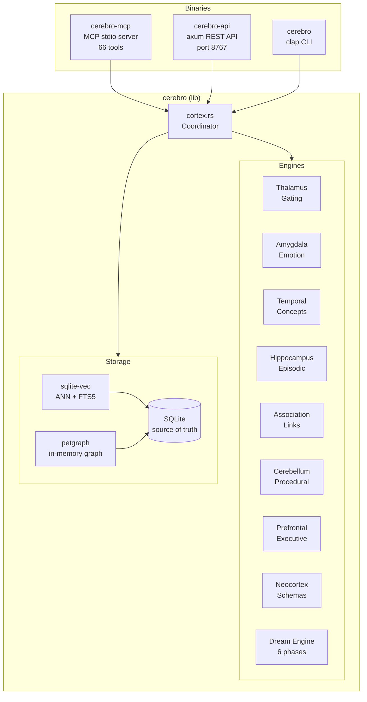
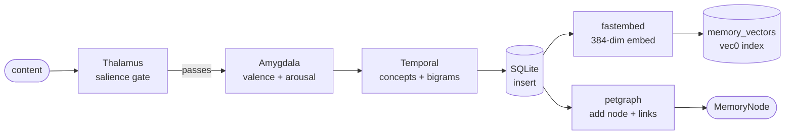
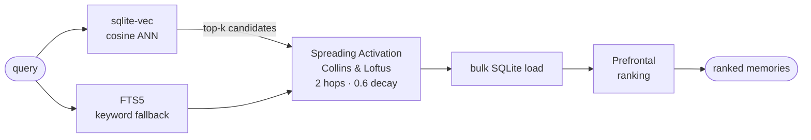
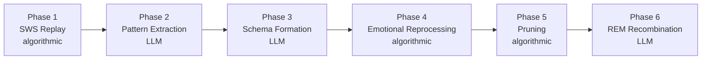
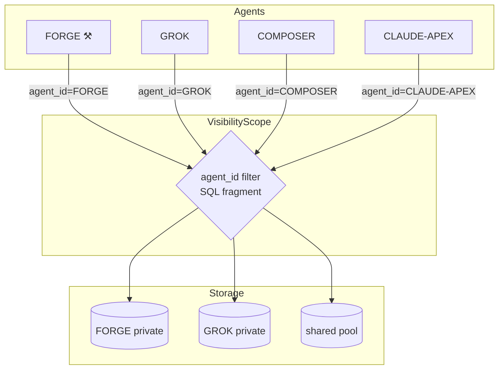

# CerebroCortex-RS

> A brain-analogous AI memory system — pure Rust, single binary, runs on a Pi Zero W2.

[](https://rustup.rs)
[](LICENSE)
[]()

**66 MCP tools. One SQLite file. No external processes. Drop-in for the Python original — agentd never knew.**

---

## TL;DR

CerebroCortex-RS is a complete Rust port of [CerebroCortex](https://github.com/buckster123/CerebroCortex), a cognitive memory system for AI agents. It exposes 66 MCP tools over stdio, implements ACT-R activation, FSRS spaced-repetition, spreading activation, and a 6-phase dream consolidation engine — all in a single statically-linked binary with no Python runtime, no separate vector DB process, and no GPU required.

```
Bare binary (no model):  23 MB RSS,  6 threads,  26 ms recall
With BGE-small-en-v1.5: 275 MB RSS,  9 threads,  26 ms recall (cosine ANN)
Binary size:              29 MB stripped arm64 ELF
Cold start:              ~4.4 s (graph rebuild + model load from cache)
```

Hot-swapped into a live [ApexOS](https://github.com/buckster123/ApexOS) Pi 5 by changing one line in `plugins.toml`. agentd counted 66 tools and moved on.

---

## Why

| | Python | Rust |
|---|---|---|
| Runtime | CPython + venv + pip | Single binary |
| Vector DB | chromadb (separate process) | sqlite-vec (SQLite extension) |
| Graph | python-igraph (C binding) | petgraph (pure Rust) |
| Embeddings | sentence-transformers (PyTorch) | fastembed (ONNX, ~33 MB model) |
| REST | FastAPI + uvicorn | axum |
| MCP | MCP Python SDK | Hand-rolled JSON-RPC over stdio |
| Idle RAM | ~180 MB | 23 MB (no model) / 275 MB (with model) |
| Pi Zero W2 capable | No | Yes (embedding disabled) |
| DB migration | Manual | Auto-detects and migrates Python `cerebro.db` on first start |

**Key insight:** `sqlite-vec` + FTS5 means the entire storage layer — relational data, full-text search, and approximate nearest-neighbour vector search — lives in **one SQLite file**. Zero extra processes, zero network calls for retrieval.

---

## Architecture



### Workspace layout

```
crates/
  cerebro/        # library — all cognitive logic (types, models, activation, engines, storage)
  cerebro-mcp/    # MCP-over-stdio binary — ApexOS drop-in, 66 tools
  cerebro-api/    # axum REST API + dashboard (optional, port 8767)
  cerebro-cli/    # clap CLI (cerebro remember / recall / stats / dream ...)
```

---

## Memory pipeline

### remember()



### recall()



**Recall score:**
```
score = 0.35 × vector_sim + 0.30 × ACT-R + 0.20 × FSRS + 0.15 × salience
```

---

## Cognitive model

### Memory types and layers

```
MemoryType:  Episodic | Semantic | Procedural | Affective | Prospective | Schematic
MemoryLayer: Sensory (minutes) → Working (days) → LongTerm (months) → Cortex (permanent)
Visibility:  Private (agent-only) | Shared (all agents) | Thread (cross-agent dialogue)
```

### Activation math

**ACT-R base-level activation** — recency + frequency decay:
```
B(t) = ln( Σ t_k^{-d} ) + ε
```
- `t_k` = seconds since k-th access, `d` = 0.5, `ε` ~ Uniform(±0.4)
- Access timestamps capped at 50 per memory

**FSRS retrievability** — spaced-repetition forgetting curve:
```
R(t, S) = (1 + t / 9S)^{-1}
```
- `t` = days since last review, `S` = stability (days)
- S updated on retrieval: success → grows, failure → `S × 0.5`

**Spreading activation** — Collins & Loftus:
- BFS from seed nodes, max 2 hops, 0.6 decay/hop, 50-node cap
- Edge conductance = `link_type_weight × link.effective_weight(now)`
- Link weight decays with a 30-day half-life

---

## Dream engine — 6-phase consolidation



| Phase | Engine | Description |
|-------|--------|-------------|
| 1 — SWS Replay | Algorithmic | Replay recent episodes; strengthen temporal links |
| 2 — Pattern Extraction | LLM | Cluster similar memories; summarise emergent patterns |
| 3 — Schema Formation | LLM | Abstract episodic memories → schematic memories |
| 4 — Emotional Reprocessing | Algorithmic | Adjust salience based on emotional markers |
| 5 — Pruning | Algorithmic | Remove stale, low-salience, orphan sensory memories |
| 6 — REM Recombination | LLM | Surface non-obvious connections across the graph |

LLM phases require `ANTHROPIC_API_KEY`. Phases 2, 3, 6 skip gracefully when unset — algorithmic phases always run. LLM call budget: 20 calls per dream cycle per agent.

---

## Multi-agent isolation



Every SQL query carries a `VisibilityScope` that AND-injects a filter:
```sql
-- private query for FORGE:
WHERE (visibility='shared' OR (visibility='private' AND agent_id='FORGE'))
      AND deleted_at IS NULL
```

Agents can `share_memory` to promote private → shared, `send_message` for cross-agent inbox delivery, and `get_thread_memories` for shared dialogue context.

---

## MCP tool surface (66 tools)

<details>
<summary>Full tool list by category</summary>

| Category | Tools |
|----------|-------|
| Core | `remember`, `recall`, `get_memory`, `memory_store`, `memory_search`, `update_memory`, `delete_memory` |
| Association | `associate`, `memory_neighbors`, `common_neighbors`, `find_path`, `check_near_duplicates` |
| Session/thread | `session_save`, `session_recall`, `get_thread_memories`, `list_threads`, `prune_thread` |
| Episodic | `episode_start`, `episode_add_step`, `episode_end`, `get_episode`, `get_episode_memories`, `list_episodes` |
| Dream | `dream_run`, `dream_status` |
| Prospective | `store_intention`, `list_intentions`, `resolve_intention` |
| Procedural | `store_procedure`, `list_procedures`, `find_relevant_procedures`, `record_procedure_outcome` |
| Schemas | `create_schema`, `list_schemas`, `find_matching_schemas`, `get_schema_sources` |
| Analytics | `emotional_summary`, `activation_curve`, `activation_heatmap`, `activation_at_risk`, `memory_health`, `cortex_stats`, `memory_graph_stats`, `audit_summary`, `query_audit` |
| Tags | `list_tags`, `delete_tag`, `rename_tag`, `merge_tags` |
| Multi-agent | `register_agent`, `list_agents`, `share_memory`, `send_message`, `check_inbox` |
| Lifecycle | `list_deleted`, `restore_memory`, `purge_memory`, `bulk_delete`, `purge_all_deleted`, `get_memory_versions`, `restore_version` |
| Export | `export_memories` |
| Bootstrap | `cognitive_bootstrap`, `ingest_file`, `describe_image`, `search_vision` |

</details>

Wire format: newline-delimited JSON-RPC 2.0 over stdin/stdout. Protocol version `"2024-11-05"`. Stderr is exclusively for tracing logs — stdout is the MCP stream.

---

## Storage

**SQLite is the single source of truth.** Graph and vector index are derived caches rebuilt on startup.

```
memories           — 19 columns; access_times JSON for ACT-R; embedding BLOB for vec0
links              — (source_id, target_id, link_type) PK; traversal stats for decay
memories_fts       — FTS5 virtual table; INSERT/UPDATE/DELETE triggers keep it in sync
memory_vectors     — vec0 virtual table (sqlite-vec); rowid-joined to memories
audit_log          — append-only agent action log
episodes / steps   — episodic sequence storage
dream_reports      — persisted dream cycle output
schema_version     — migration tracking (version 100 = migrated from Python schema)
```

**Python DB auto-migration:** point `CEREBRO_DATA_DIR` at an existing Python `cerebro.db` and start the binary. `SqliteStore::open()` detects the Python schema, migrates in a single atomic transaction, and marks completion with `schema_version=100`. Subsequent starts are no-ops. Old Python tables are preserved as `_py_*` for safety.

---

## Deployment

### ApexOS drop-in (Pi 5)

```toml
# /etc/agentd/plugins.toml
[[plugin]]
id      = "cerebro"
cmd     = "cerebro-mcp"
restart = "always"
[plugin.env]
CEREBRO_DATA_DIR    = "/var/lib/agentd/cerebro"
FASTEMBED_CACHE_DIR = "/var/lib/agentd/cerebro/models"
RUST_LOG            = "warn"
```

```bash
sudo systemctl restart agentd
# [supervisor] plugin 'cerebro' up — 66 tools
```

### Build on Pi (arm64)

Always build natively — never cross-compile.

```bash
git pull
cargo build --release -p cerebro-mcp
sudo systemctl stop cerebro-mcp
sudo cp target/release/cerebro-mcp /usr/local/bin/cerebro-mcp
sudo systemctl start cerebro-mcp
```

### fastembed pre-warm

On first deploy, download the model to the cache dir before agentd starts it:

```bash
sudo mkdir -p /var/lib/agentd/cerebro/models
sudo chown agentd:agentd /var/lib/agentd/cerebro/models

# Run as the service user — downloads ~128 MB on first run
printf '{"jsonrpc":"2.0","id":1,"method":"initialize","params":{"protocolVersion":"2024-11-05","capabilities":{},"clientInfo":{"name":"prewarm","version":"0.1"}}}\n{"jsonrpc":"2.0","id":2,"method":"tools/call","params":{"name":"remember","arguments":{"content":"prewarm","memory_type":"semantic"}}}\n' | \
  sudo -u agentd env \
    CEREBRO_DATA_DIR=/var/lib/agentd/cerebro \
    FASTEMBED_CACHE_DIR=/var/lib/agentd/cerebro/models \
  /usr/local/bin/cerebro-mcp
```

### Platform tiers

The same binary, different env vars. No special builds per device.

| Tier | Hardware | `CEREBRO_EMBED_MODEL` | RSS | Search |
|------|----------|-----------------------|-----|--------|
| **Nano** | Pi Zero 2W, any 512MB board | `""` (disabled) | ~23 MB | FTS5 keyword |
| **Micro** | Pi 4 1-2GB | `BAAI/bge-small-en-v1.5` | ~275 MB | cosine ANN (384-dim) |
| **Standard** | Pi 5, x86 mini-PC | `BAAI/bge-small-en-v1.5` | ~275 MB | cosine ANN |
| **Pro** | x86 + GPU (CUDA/ROCm/CoreML) | `BAAI/bge-large-en-v1.5`* | ~500 MB | cosine ANN (1024-dim) |

\* `bge-large` support and GPU ONNX execution providers are planned — CPU works everywhere today, GPU is additive.

**Why this matters:** Pi 5 16GB now sells for $300+. The real target is the hardware sitting in drawers — last-gen mini-PCs, replaced Mac Minis, Pi 4s from the before-times. With `CEREBRO_EMBED_MODEL=""` the entire memory system runs in 23 MB RSS, leaving the rest for agentd, local inference, and the OS.

### Running without embeddings (Pi Zero W2 / 1 GB devices)

Set `CEREBRO_EMBED_MODEL=""` — fastembed init is skipped, FTS5 handles all search. RSS stays at ~23 MB. Recall latency unchanged (~26 ms, pure FTS5 + spreading activation).

---

## Environment variables

| Variable | Default | Purpose |
|----------|---------|---------|
| `CEREBRO_DATA_DIR` | `~/.cerebro-cortex/` | SQLite DB root |
| `CEREBRO_EMBED_MODEL` | `BAAI/bge-small-en-v1.5` | fastembed model ID (empty = disable) |
| `FASTEMBED_CACHE_DIR` | `.fastembed_cache` | Model cache directory |
| `ANTHROPIC_API_KEY` | — | Required for dream engine LLM phases (2, 3, 6) |
| `RUST_LOG` | `info` | Tracing filter — logs go to stderr |

---

## Building from source

```bash
git clone https://github.com/buckster123/CerebroCortex-RS
cd CerebroCortex-RS
cargo build --release        # all four crates
cargo test                   # 116 tests
```

**Test suite:**

| Suite | Tests | Gate |
|-------|-------|------|
| types | 6 | serde round-trips |
| activation | 41 | ACT-R + FSRS + spreading vs Python fixtures (within 1e-4) |
| storage | 21 | SQLite CRUD, vector search, graph rebuild |
| engines | 34 | all 8 deterministic engines |
| cortex | 6 | end-to-end remember + recall |
| cerebro-mcp | 8 | MCP dispatch + tool routing |
| db_compat | 2 | Python → Rust DB migration |
| **total** | **118** | |

---

## Related

- [CerebroCortex](https://github.com/buckster123/CerebroCortex) — Python original (reference implementation, production daily driver)
- [ApexOS](https://github.com/buckster123/ApexOS) — the agent runtime this plugs into

---

## License

MIT
