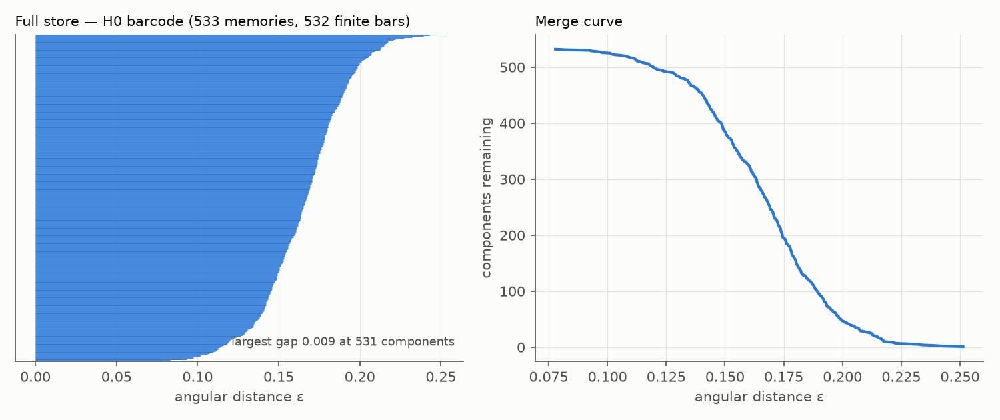
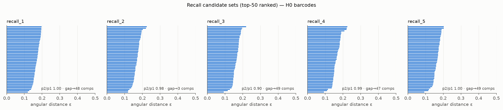
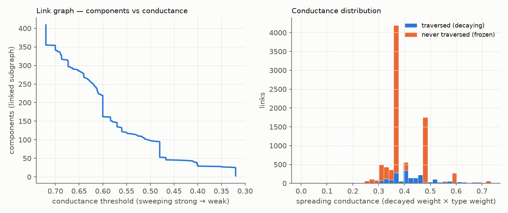

# FINDINGS-0 — Phase 0: harness + first barcodes (2026-07-27)

Companion to `CEREBRO_TOPO_EXPLORATION_PLAN.md` §3. Everything below ran against
the pinned post-backfill snapshot `cerebro.db.topo-pin-20260727` (533 live
memories — the 532 backfilled plus one session note saved after; 9,424 links).
Harness: `scripts/topo/` (`loader.py`, `h0.py`, `fixtures.py`, `validate.py`,
`phase0.py`), figures in `topo-figs/`. Decay evaluated at fixed
`NOW = 2026-07-27T12:00Z` for reproducibility.

## Validation gate — all 14 checks pass

- Hand-rolled union-find H0 deaths **exactly equal** scipy single-linkage merge
  heights on all four point fixtures (atol 1e-12).
- `decayed_link_weight` parity: never-traversed ⇒ unchanged; 270 d ⇒ exactly
  half; 30 d ⇒ 0.9·w; future timestamps ⇒ unchanged.
- ripser finds the planted 384-dim circle: top H1 persistence 0.173 vs 0.000
  second — **E5's tooling is proven end-to-end**.
- Fixture lesson worth keeping: per-coordinate σ=0.05 noise in 384-dim has norm
  ≈ 0.05·√384 ≈ 0.98 — the "tight blob" dissolved and the first validation run
  failed. Fixtures now parameterize noise by **total norm** (σ = norm/√dim).
  Distance concentration bit the *fixtures* before it bit the data.

## Verified environment facts

- **bge-small vectors arrive unit-norm from fastembed**: mean ‖v‖ = 1.0000000,
  σ = 1.5e-7 over all 533. Angular distance is well-defined; the §2 checkbox
  is closed.
- Distance convention locked: `d = arccos(clip(cos))/π` (documented in
  `loader.py`, used everywhere).

## The full-store point cloud is one soup — concentration is real

- Pairwise angular distances: mean 0.256, median 0.258, **90% of all pairs
  inside [0.205, 0.303]** — a 0.10-wide band.
- H0: largest merge gap is only 0.009 and sits at **531 components** (i.e.
  between near-duplicate early merges); p2/p1 of the two longest bars = 0.97;
  merge curve is a smooth sigmoid over ε ≈ 0.13–0.20. **No macro two-island
  structure in embedding space** — plausible for one brain dominated by
  same-shaped session notes.
- Consequence (binds E1/E6/S2): any shipped statistic must be **relative**
  (ratios, ranks, bootstrap nulls). Absolute ε thresholds are meaningless at
  this concentration. Exactly plan §9 risk 1, now quantified.

## Recall candidate sets — weak but correctly-ordered signal (n=5)

Top-50 ranked results per real transcript query, H0 on each set:

| set | query (abbrev.) | p2/p1 | gap → components |
|-----|-----------------|-------|------------------|
| 1 | CC-RS build status | 1.00 | 48 |
| 2 | Pi deploy w/ systemd (natural lang.) | 0.98 | **3** |
| 3 | Occipital many-term multi-topic | **0.90** | 49 |
| 4 | VIMANA teaser/ffmpeg | 0.99 | 47 |
| 5 | ApexOS backport+docs+UI | 1.00 | 49 |

- The most multi-topic query (3) has the lowest p2/p1; the natural-language
  query (2) resolves into a visible 3-cluster story. The rest are single-soup.
  Ordering matches intuition — promising for E1, but n=5 is an anecdote. E1
  proper needs the ~100-query replay + a bootstrap null.
- **Plan correction (E1):** the plan defines coherence `C = 1 − p2/p1` and
  labels it "C→1: one tight idea; C→0: two rival clusters" — formula and label
  are **inverted** (a tight single-scale set has p2/p1 → 1, so C → 0). We
  report the raw ratio and call it what it is: **merge-dominance** (low ratio =
  one towering split = multi-topic candidate set). E1 should adopt the raw
  ratio and drop the C name.

## The link graph — the headline finding

- **The graph never coheres.** At *any* conductance threshold — including raw
  stored weights with every edge included — the linked subgraph stays at
  **3 permanent components**: the main mass (405), the **Occipital-RS
  deploy/integration island (3)**, and the **Slint/OpenGL face-procedure
  island (2)**. On top of that, **123 of 533 memories (23%) have no live link
  at all**. The plan's "coherence threshold" metric must handle
  "never" as a first-class answer; component count + island roster is the
  honest report.
- Fragmentation mechanism is **topic-batch accretion**: recent work areas
  link among themselves at store time and nothing ever bridges them to the
  older graph (the bridging phases — REM recombination, rediscovery — run
  rarely on this brain). `memory_health` today reports none of this. **E2's
  watchdog premise is validated on first contact with real data.**
- **79.1% of links are frozen** (never traversed ⇒ never decay, exact port
  semantics) and conductance is **quantized into a handful of spikes**
  (default stored weights × the 9 type weights — e.g. 0.5×0.8, 0.6×0.8).
  Link *weights* carry almost no continuous information today; **connectivity,
  not weight, is the informative axis** of this graph. This further demotes
  weight-decay forecasting (plan §0.5.5) and promotes component/island
  tracking as E2's core deliverable.

## Amendments fed back to the plan

1. E1: replace `C = 1 − p2/p1` with the raw merge-dominance ratio (naming +
   direction fixed); all E1 stats relative/bootstrapped.
2. E2: "days-until-fragmentation" is dead as designed (§0.5.5 + quantization
   above); core deliverable = component count, island roster (with member
   previews), isolated-node count/percent, plus the conductance sweep curve.
   "Coherence threshold" may be `null` — report it honestly.
3. E5 sampling: whole store; concentration means H1 bars (if any) will be
   short — judge them against a shuffled-null, not absolute persistence.

## Next

E2 first (fixture (e) already gates the sweep; the real-store story above is
its pilot), then E1 with the full transcript corpus + LLM ambiguity judgments.
S0 design (context capture) unchanged by anything found here.
