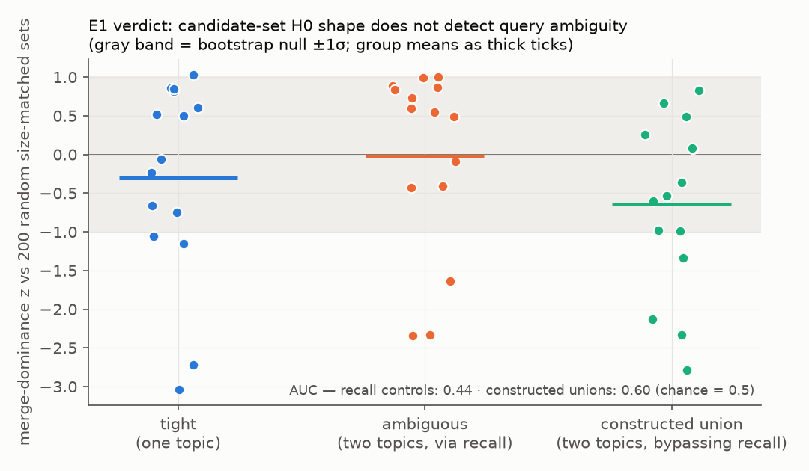

# FINDINGS-1 — Phase 1 experiments

Companion to `CEREBRO_TOPO_EXPLORATION_PLAN.md` §4. One section per experiment
as each concludes. E2 first (as sequenced); E1/E3 to follow.

## E2 — Link-graph fragmentation watchdog: GATE PASSED → SHIPPED (2026-07-27)

**Gate recap.** Both halves landed in Phase 0: the union-find sweep is
fixture-exact (fixture (e) coheres at exactly its constructed 0.4 threshold,
`validate.py`), and the real store told a *very* legible story — the FINDINGS-0
headline: 3 permanent components, 23% isolated, 79% frozen links.

**Ship.** `memory_health` now returns a `graph` section:

```json
"graph": {
  "live_memories": 534, "linked_memories": 410,
  "isolated_memories": 124, "isolated_pct": 23.2,
  "live_links": 9424, "never_traversed_links_pct": 79.1,
  "components": 3, "largest_component": 405,
  "islands": [ { "size": 3, "members": [ {"id": "...", "preview": "..."} ] }, ... ],
  "islands_truncated": false
}
```

(The numbers above are the live FORGE brain at ship time — the watchdog names
the Occipital-RS deploy island and the GL-face procedure island by content
preview, exactly the islands Phase 0 identified.)

Design decisions, recorded:

- **Whole-store connectivity, deliberately.** Links carry no scope and
  spreading crosses agents; a scope-filtered component count would report fake
  fragmentation. Island member **previews** are scope-filtered instead —
  out-of-scope members appear as bare ids (test-locked).
- **Computed from SQLite truth, not the petgraph cache** (union-find over live
  memories + live-endpoint links via `petgraph::unionfind`, already a dep) —
  no staleness coupling, works in every front-end (`cerebro-mcp`,
  `cerebro-api`, CLI all share the store method).
- **Islands capped** at 8 islands × 3 member previews (`islands_truncated`
  flags overflow); the largest component never gets a roster — islands are the
  actionable part.
- **The conductance sweep / coherence threshold did NOT ship** into the health
  surface. FINDINGS-0 showed link weights are quantized into a few spikes and
  79% never move — connectivity is the whole signal today. The sweep stays an
  exploration tool (`scripts/topo/`); revisit only if weight dynamics ever go
  live (traversal updates / dream strengthening at real volume).
- Cost: one id scan + one link scan + union-find, only when `memory_health` is
  called. Nano-safe (no embeddings). No new dependencies.

**What the watchdog is for.** The known failure mode is topic-batch accretion:
new work areas link among themselves and never bridge to the older graph, so
spreading activation silently can't reach them from the main mass. Agents (and
dream-phase consumers) now see `components > 1` + named islands and can act —
`associate` a bridging link, or let a future dream phase consume the roster.

**Follow-up candidates** (not scheduled): a dream-phase consumer that proposes
bridges for islands (REM recombination already random-pairs; islands are
better targets); isolated-node triage (23% is a lot of unreachable memory).

### E2 postscript — the first topology-guided intervention (same day)

Used the shipped watchdog to actually *heal* the live brain, and it earned its
keep twice over:

1. Bridged the GL-face island to the June GL-face session summary
   (`derived_from` — the procedures were distilled in the same minute as that
   summary). Island absorbed ✓.
2. First Occipital bridge went to a recent Occipital close-note — and the
   watchdog reported the island had **grown to 4**: the chosen anchor was
   itself an isolated node (isolated 124→123), so the bridge merged it INTO
   the island. Re-anchored to a verified high-degree node (178 links) →
   **`components: 1, islands: []`** — the graph fully connected for the first
   time.
3. The wrong-anchor incident exposed a real **port gap**: Python `remember()`
   step 5 is "Link engine (auto-link to related memories)"
   (`src/cerebro/cortex.py`); the Rust pipeline (thalamus → amygdala →
   temporal → SQLite → embed → graph node) **has no auto-link step**. Every
   Rust-stored memory is born isolated — that is the root cause of both the
   23% isolated share and the island-formation mechanism ("topic-batch
   accretion" = a batch only links internally when something episodic ties
   it). **Candidate fix, flagged for decision: port the auto-link step.**
   This is the highest-leverage recall-quality item found by the whole
   exploration so far — 123 memories spreading activation cannot reach.

   **RESOLVED (same day)** — André green-lit it; the port shipped as
   `fix/remember-auto-link`. Reading Python first paid off again: the linking
   is *not* vector-based — it is shared-**tags** → semantic
   (w = 0.3 + 0.1·overlap, cap 0.8), shared-**concepts** → semantic
   (w = 0.3 + 0.15·overlap, cap 0.9), and same-**valence** → affective
   (w = max(0.3, 0.7 − |Δintensity|·0.5), top-salience, ≤3) — all scope-aware
   (`_scope_sql(agent_id)` mirrored exactly). Two deliberate deviations:
   bookkeeping tags never link (Python linked on ALL tags — that is precisely
   how its 269 session notes inter-linked into the hairball), and tag/concept
   matching is JSON-quoted (Python's unquoted LIKE also matched substrings —
   "rust" hit "trust"). Plus `cerebro autolink` retrofits the stranded
   backlog, mirroring the `backfill` pattern.

## E1 — Retrieval merge-dominance: GATE FAILED, parked (2026-07-27)

**Protocol.** 14 real transcript queries + 30 labeled synthetic controls (15
single-topic, 15 two-distant-topics), every query through the real Rust recall
pipeline (`cerebro recall -n 50 --json`) against a fresh scratch copy of the
pin. Per candidate set: merge-dominance p2/p1, components-at-largest-gap, k=2
silhouette, mean pairwise distance, and a bootstrap z of dominance against 200
random size-matched store subsets (everything relative, per FINDINGS-0).
`scripts/topo/e1.py`; full numbers in `out/e1/e1_report.json` (regenerable).

**Result — chance, across the board.** AUC on the labeled controls
(ambiguous = positive): dominance 0.44, dominance-z 0.41, silhouette 0.53,
mean pairwise 0.49. No metric separates tight from ambiguous queries; some of
the strongest "two-cluster" signals sit on *tight* queries (audit-retention:
z = −3.0) while jammed two-topic queries come back single-soup (z = +1.0).
Phase-0's promising n=5 ordering did not survive controls — exactly what the
gate discipline exists to catch.

**Where the signal dies — both layers, demonstrated** (`e1_union.py`):
constructed two-topic sets (25+25 unions of distinct tight-query results,
bypassing retrieval) still barely separate from single-topic sets — AUC 0.60,
mean z −0.64 vs −0.27. So:

1. **The metric is nearly blind at this store's concentration** (90% of
   pairwise distances in a 0.10 band; topic clusters are not tight relative
   to inter-topic distances — the mega-session-notes span topics and pull
   everything together). Even ground-truth mixtures barely register.
2. **Retrieval dissolves mixtures on top of that**: a jammed query's embedding
   is a midpoint, and the top-50 fills with midpoint-adjacent multi-topic
   session notes rather than two clusters (real-recall ambiguous sets did
   *worse* than constructed unions).



**Verdict: E1 gate FAILED — no coherence/dominance field ships on recall.**
Per plan rule 2/3 this is a valid documented outcome; the alternative was
shipping a noise field. Parked with a written re-test trigger: revisit only if
the store's concentration picture changes materially (e.g. a colony node's
much larger, more topically-differentiated brain, or an embed-model migration
— E6 would notice). The H0 machinery itself is fine (fixture-validated);
what failed is this *use* of it on this *store*.

**Standing next steps** (unchanged by E1's failure): the auto-link port-gap
fix above; E3 (dream-clustering comparison — different data shape: ≤500-memory
dream samples clustered for LLM consumption, where even weak structure may
beat tag-grouping); S0 (invocation logging + grading habit).
